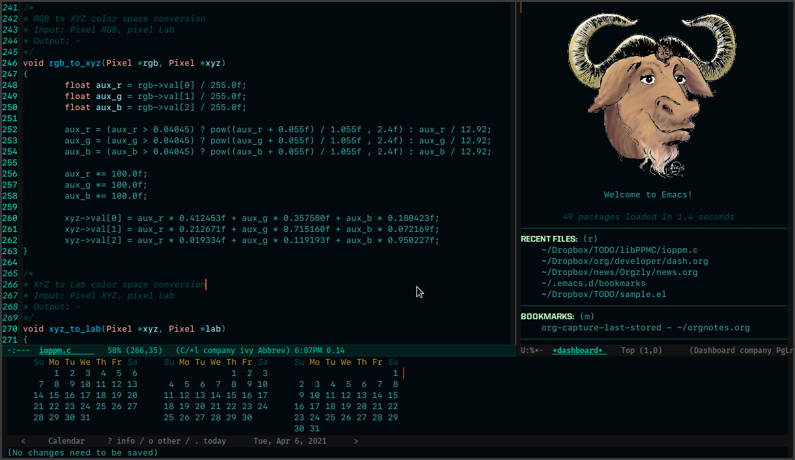

# emacs-dark-flux


# Customizations

### Packages

These are some of my favorite packages, that will make emacs look great:

* [Emacs Dashboard](https://github.com/emacs-dashboard/emacs-dashboard) An extensible emacs startup screen showing you what’s most important.
* [All-The-Icons](https://github.com/domtronn/all-the-icons.el) A utility package to collect various Icon Fonts and propertize them within Emacs.
* [emacs-neotree](https://github.com/jaypei/emacs-neotree) A Emacs tree plugin like NerdTree for Vim.

### Fonts

My settings for fonts:

```emacs-lisp
(add-hook 'text-mode-hook
      (lambda ()
        (variable-pitch-mode 1)))
(set-face-attribute 'fixed-pitch nil :family "SF Mono")
(set-face-attribute 'variable-pitch nil :family "IBM Plex Sans")
```
